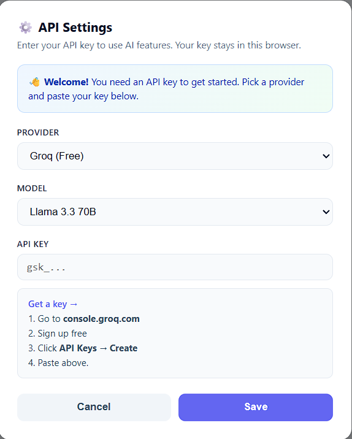
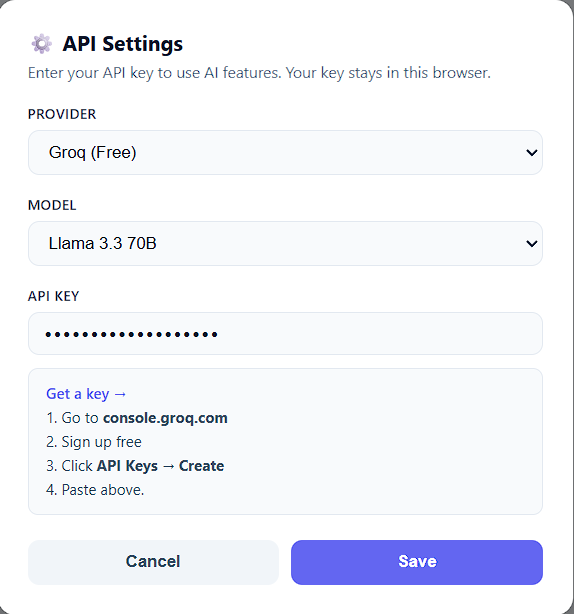

<div align="center">
  
</div>

<div align="center">

[](https://github.com/AOSSIE-Org/BringYourOwnKey)

[](https://t.me/StabilityNexus)
[](https://x.com/aossie_org)
[](https://discord.gg/hjUhu33uAn)
[](https://news.stability.nexus/)
[](https://www.linkedin.com/company/aossie/)
[](https://www.youtube.com/@AOSSIE-Org)

</div>

---

# BringYourOwnKey

**BringYourOwnKey (BYOK)** is a lightweight, framework-agnostic library that lets users supply their own LLM API keys directly in your app — no proxy, no extra backend service required. A browser-side widget collects and stores the key locally; a one-function backend helper reads it from request headers. Your existing `frontend + backend` architecture stays exactly as it is.

```
Browser (your frontend)                      Your FastAPI / Starlette backend
┌──────────────────────────┐                 ┌──────────────────────────────┐
│  byok.getHeaders()       │──your fetch()──>│  creds = extract_byok(req)   │
│  {                       │                 │  # creds.api_key             │
│    X-BYOK-Api-Key,       │                 │  # creds.provider            │
│    X-BYOK-Provider,      │                 │  # creds.model               │
│    X-BYOK-Model          │                 │                              │
│  }                       │                 │  client = Groq(creds.api_key)│
└──────────────────────────┘                 └──────────────────────────────┘
   Key stored in localStorage only.            You create the LLM client.
   Library never makes requests for you.        Library never touches LLMs.
```

---

## 🚀 Features

- **Zero extra services** — no LiteLLM proxy, no auth middleware backend. Drop it into any existing project.
- **You own the request** — `getHeaders()` returns a plain object you spread into your own `fetch()`. The library never calls your API on your behalf.
- **Framework agnostic** — frontend is a standard Web Component (`<byok-settings>`); works in React, Vue, Svelte, Next.js, or plain HTML. Backend is pure Starlette; works with FastAPI or bare Starlette.
- **Secure by design** — keys live only in the user's browser (`localStorage`). They never touch your server's storage or logs.
- **Built-in provider presets** — Groq (free tier), OpenAI, and Google Gemini ship out of the box, each with model lists and key validation.
- **Minimal surface** — 4 Python exports, 6 TypeScript exports. Nothing else to learn.

---

## 💻 Tech Stack

### Frontend
- TypeScript (Web Components / Custom Elements)
- No framework dependency — works with React, Vue, Svelte, Next.js, or plain HTML

### Backend
- Python 3.9+
- Starlette ≥ 0.27 (FastAPI compatible — FastAPI is built on Starlette)

---

## ✅ Project Checklist

- **The AI/ML components:**
  - [x] LLM provider selection and model configuration are documented
  - [x] API keys are managed client-side only — never stored server-side
  - [x] Key format validation is implemented per provider before submission
  - [x] Rate limit handling is delegated to the caller (you control the request)

---

## 🔗 Repository Links

1. [Main Repository](https://github.com/AOSSIE-Org/BringYourOwnKey)
2. [Frontend source](https://github.com/AOSSIE-Org/BringYourOwnKey/tree/main/frontend/src)
3. [Python backend source](https://github.com/AOSSIE-Org/BringYourOwnKey/tree/main/src/byok)

---

## 🏗️ Architecture Diagram

```
┌─────────────────────────────────────────────────────────────────────┐
│                         User's Browser                              │
│                                                                     │
│  ┌─────────────────┐    saves     ┌──────────────────────────────┐  │
│  │  <byok-settings>│ ──────────> │  localStorage                │  │
│  │  Web Component  │             │  { activeProvider, keys, ... }│  │
│  └─────────────────┘             └──────────────────────────────┘  │
│           ▲ opens                          │ reads                  │
│           │                               ▼                         │
│  ┌─────────────────┐            ┌──────────────────────────────┐   │
│  │  Your App UI    │            │  byok.getHeaders()           │   │
│  │  (settings btn) │            │  → X-BYOK-Api-Key            │   │
│  └─────────────────┘            │  → X-BYOK-Provider           │   │
│                                 │  → X-BYOK-Model              │   │
│                                 └──────────────┬───────────────┘   │
└────────────────────────────────────────────────┼───────────────────┘
                                                 │ spread into fetch()
                                                 ▼
┌─────────────────────────────────────────────────────────────────────┐
│                      Your FastAPI / Starlette Backend               │
│                                                                     │
│  ┌──────────────────────────────────────────────────────────────┐  │
│  │  @app.post("/api/chat")                                       │  │
│  │  async def chat(request: Request):                           │  │
│  │      creds = extract_byok(request)   ← reads the 3 headers  │  │
│  │      client = Groq(api_key=creds.api_key)                   │  │
│  │      # ... call LLM with user's own key                      │  │
│  └──────────────────────────────────────────────────────────────┘  │
└─────────────────────────────────────────────────────────────────────┘
```

---

## 🔄 User Flow

```
App loads
    │
    ▼
byok.guardFirstRun()
    │
    ├─ Key already saved? ──Yes──> App ready, proceed normally
    │
    └─ No key yet
           │
           ▼
    <byok-settings> modal opens (first-run banner shown)
           │
           ├─ User picks provider + model + pastes key
           │
           ├─ Key validated client-side (prefix + length check)
           │
           └─ Saved to localStorage ──> modal closes ──> App ready
                                                              │
                                                              ▼
                                                   User triggers an AI action
                                                              │
                                                              ▼
                                                   byok.getHeaders() called
                                                              │
                                                              ▼
                                                   fetch("/api/...", { headers: {...headers} })
                                                              │
                                                              ▼
                                                   Backend: extract_byok(request)
                                                              │
                                                              ▼
                                                   LLM called with user's own key
```

### Key User Journeys

1. **First-time setup** — User lands on the app, no key configured. `guardFirstRun()` auto-opens the settings modal. User picks Groq (free), pastes their key, clicks Save. App proceeds immediately — no page reload needed.

2. **Changing provider or model** — User clicks the ⚙️ settings button in your app. `openSettings()` opens the modal. User switches from Groq to Gemini, saves. All subsequent `getHeaders()` calls return the new provider's key automatically.

3. **Calling the backend** — Your frontend calls `byok.getHeaders()`, spreads the three headers into any `fetch()` call. The backend calls `extract_byok(request)` to get a typed `BYOKCredentials` object and immediately creates the LLM client with the user's key.

---

## 🍀 Getting Started

### Prerequisites

- **Frontend**: Node.js 18+ and npm (only needed if using a bundler; plain HTML works without a build step)
- **Backend**: Python 3.9+, pip

---

### Backend Installation

```bash
# Minimal (Starlette only):
pip install -e .

# With FastAPI:
pip install -e ".[fastapi]"

# Development (pytest, uvicorn, fastapi):
pip install -e ".[dev]"
```

#### Option A — Per-route (recommended)

```python
from fastapi import FastAPI, Request
from byok import extract_byok
from groq import Groq

app = FastAPI()

@app.post("/api/analyze")
async def analyze(request: Request, body: dict):
    creds = extract_byok(request)
    # creds.api_key  → "gsk_..."
    # creds.provider → "groq"
    # creds.model    → "groq/llama-3.3-70b-versatile"

    client = Groq(api_key=creds.api_key)
    response = client.chat.completions.create(
        model=creds.model or "llama-3.3-70b-versatile",
        messages=[{"role": "user", "content": body["text"]}],
    )
    return {"result": response.choices[0].message.content}
```

#### Option B — Middleware (protects all routes at once)

```python
from fastapi import FastAPI
from byok import BYOKMiddleware, get_byok

app = FastAPI()
app.add_middleware(BYOKMiddleware)

@app.post("/api/analyze")
async def analyze(body: dict):
    creds = get_byok()   # no request param needed
    ...
```

---

### Frontend Installation

```bash
# Using npm / bundler:
cd frontend
npm install
npm run build       # outputs to frontend/dist/

# OR import directly in plain HTML (no build step):
# <script type="module">
#   import { createBYOK, PROVIDERS } from "./frontend/dist/byok.js";
# </script>
```

#### Step 1 — Create a BYOK instance

```ts
import { createBYOK, PROVIDERS } from "@byok-lib/frontend";

const byok = createBYOK({
  projectId: "my-app",
  providers: [PROVIDERS.groq, PROVIDERS.openai, PROVIDERS.gemini],
  accentColor: "#6366f1",
});
```

#### Step 2 — Guard first run

```ts
await byok.guardFirstRun();
// User now definitely has a key saved
```

#### Step 3 — Add a settings button

```ts
document.getElementById("settings-btn")!.addEventListener("click", () => {
  byok.openSettings({ onSave: (provider, key, model) => console.log("Saved") });
});
```

#### Step 4 — Pass headers in every API call

```ts
const res = await fetch("/api/analyze", {
  method: "POST",
  headers: { "Content-Type": "application/json", ...byok.getHeaders() },
  body: JSON.stringify({ text }),
});
```

---

## 📱 App Screenshots

### Settings modal — first-run state



### Settings modal — returning user



---

## 📦 Available Providers & Models

| Provider | ID | Key prefix | Free tier | Models |
|---|---|---|---|---|
| Groq | `PROVIDERS.groq` | `gsk_` | ✅ Yes | Llama 3.3 70B, Llama 3.1 8B, Compound, Compound Mini, Qwen3 32B, Kimi K2, GPT OSS 120B/20B |
| OpenAI | `PROVIDERS.openai` | `sk-` | ❌ No | GPT-4o, GPT-4o Mini |
| Google Gemini | `PROVIDERS.gemini` | `AIza` | ✅ Yes | Gemini 2.5 Flash, Flash-Lite, Pro |

---

## 📖 API Reference

### Python (`from byok import ...`)

| Export | Signature | Description |
|---|---|---|
| `extract_byok` | `(request: Request) → BYOKCredentials` | Reads the 3 BYOK headers. Raises `HTTP 401` if key or provider is missing. |
| `BYOKMiddleware` | `app.add_middleware(BYOKMiddleware, skip_paths={...})` | Auto-extracts headers on every request. Skips `/`, `/health`, `/docs`, `/openapi.json`, `/redoc` by default. |
| `get_byok` | `() → BYOKCredentials` | Returns credentials stored by `BYOKMiddleware`. Raises `HTTP 401` if called outside middleware context. |
| `BYOKCredentials` | `dataclass(api_key, provider, model?)` | Immutable, frozen credentials container. |

### TypeScript (`from "@byok-lib/frontend"`)

| Export | Type | Description |
|---|---|---|
| `createBYOK(config)` | Function | Creates a BYOK instance. Config accepts `projectId`, `providers[]`, optional `accentColor`. |
| `getHeaders()` | `() → BYOKHeaders \| null` | Returns the 3 headers ready to spread. Returns `null` if no key is configured. |
| `guardFirstRun()` | `() → Promise<boolean>` | Opens the modal if unconfigured. Resolves `true` if already set, `false` after the user saves. |
| `openSettings(opts)` | `({ onSave?, onCancel? }) → SettingsUI` | Opens the settings modal programmatically. |
| `PROVIDERS` | Object | Pre-built provider presets: `PROVIDERS.groq`, `PROVIDERS.openai`, `PROVIDERS.gemini`. |
| `KeyManager` | Class | Direct `localStorage` access. Use `keyManager.clearAll()` to reset a user's saved key. |

---

## 🙌 Contributing

⭐ Don't forget to star this repository if you find it useful! ⭐

Thank you for considering contributing to this project! Contributions are highly appreciated and welcomed. To ensure smooth collaboration, please refer to our [Contribution Guidelines](./CONTRIBUTING.md).

---

## ✨ Maintainers

- [Bruno](https://github.com/Zahnentferner)
- [Nihal](https://github.com/Nihallllll)

---

## 📍 License

This project is licensed under the GNU General Public License v3.0.
See the [LICENSE](./LICENSE) file for details.

---

## 💪 Thanks To All Contributors

Thanks a lot for spending your time helping BringYourOwnKey grow. Keep rocking 🥂

[](https://github.com/AOSSIE-Org/BringYourOwnKey/graphs/contributors)

© 2026 AOSSIE